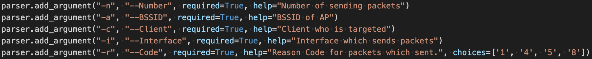
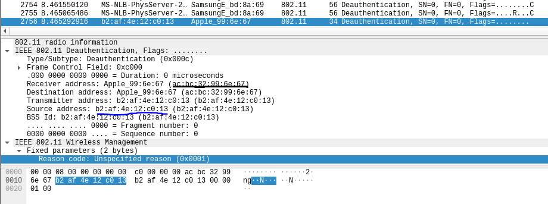
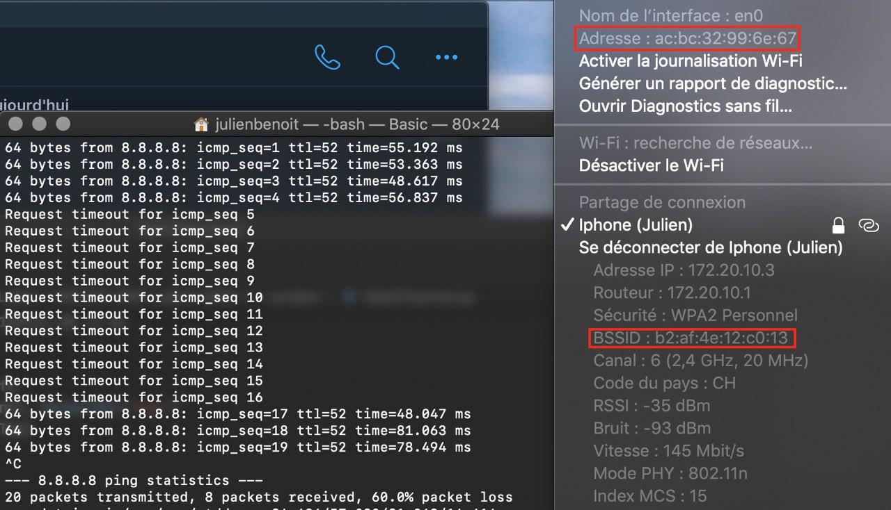
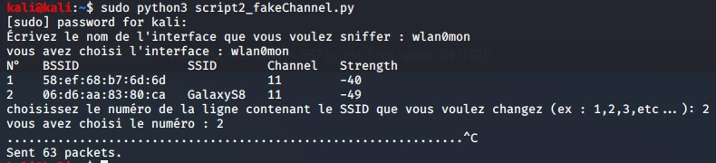
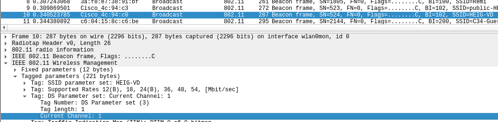
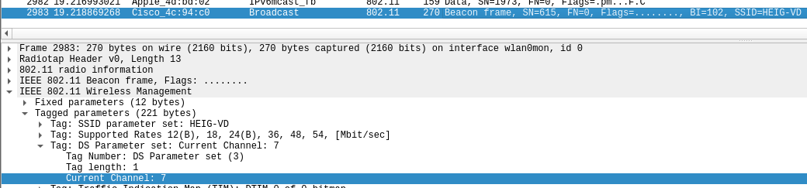
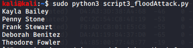
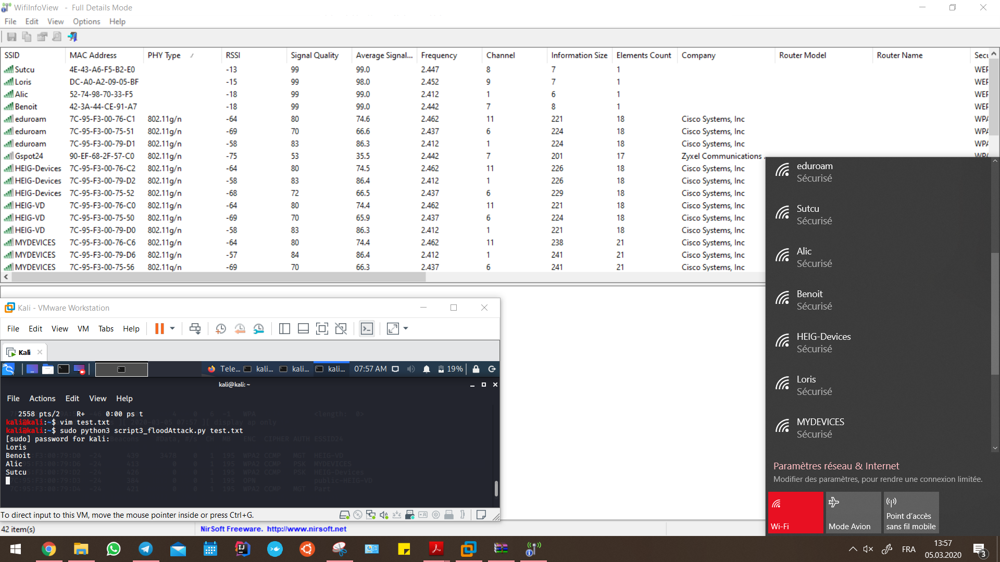

> Auteurs : Julien Benoit & Volkan Sütcü
>
> Date : 09.03.2020

[Livrables](#livrables)

[Échéance](#échéance)

[Quelques pistes importantes](#quelques-pistes-utiles-avant-de-commencer-)

[Travail à réaliser](#travail-à-réaliser)

1. [Deauthentication attack](#1-deauthentication-attack)
2. [Fake channel evil tween attack](#2-fake-channel-evil-tween-attack)
3. [SSID Flood attack](#3-ssid-flood-attack)

# Sécurité des réseaux sans fil

## Laboratoire 802.11 MAC 1

__A faire en équipes de deux personnes__

### Pour cette partie pratique, vous devez être capable de :

*	Détecter si un certain client WiFi se trouve à proximité
*	Obtenir une liste des SSIDs annoncés par les clients WiFi présents

Vous allez devoir faire des recherches sur internet pour apprendre à utiliser Scapy et la suite aircrack pour vos manipulations. __Il est fortement conseillé d'employer une distribution Kali__ (on ne pourra pas assurer le support avec d'autres distributions). __Si vous utilisez une VM, il vous faudra une interface WiFi usb, disponible sur demande__.

__ATTENTION :__ Pour vos manipulations, il pourrait être important de bien fixer le canal lors de vos captures et/ou vos injections (à vous de déterminer si ceci est nécessaire pour les manipulations suivantes ou pas). Si vous en avez besoin, la méthode la plus sure est d'utiliser l'option :

```--channel``` de ```airodump-ng```

et de garder la fenêtre d'airodump ouverte en permanence pendant que vos scripts tournent ou vos manipulations sont effectuées.


## Quelques pistes utiles avant de commencer :

- Si vous devez capturer et injecter du trafic, il faudra configurer votre interface 802.11 en mode monitor.
- Python a un mode interactif très utile pour le développement. Il suffit de l'invoquer avec la commande ```python```. Ensuite, vous pouvez importer Scapy ou tout autre module nécessaire. En fait, vous pouvez même exécuter tout le script fourni en mode interactif !
- Scapy fonctionne aussi en mode interactif en invoquant la commande ```scapy```.  
- Dans le mode interactif, « nom de variable + <enter> » vous retourne le contenu de la variable.
- Pour visualiser en détail une trame avec Scapy en mode interactif, on utilise la fonction ```show()```. Par exemple, si vous chargez votre trame dans une variable nommée ```beacon```, vous pouvez visualiser tous ces champs et ses valeurs avec la commande ```beacon.show()```. Utilisez cette commande pour connaître les champs disponibles et les formats de chaque champ.

## Travail à réaliser

### 1. Deauthentication attack

Une STA ou un AP peuvent envoyer une trame de déauthentification pour mettre fin à une connexion.

Les trames de déauthentification sont des trames de management, donc de type 0, avec un sous-type 12 (0x0c). Voici le format de la trame de déauthentification :


Le corps de la trame (Frame body) contient, entre autres, un champ de deux octets appelé "Reason Code". Le but de ce champ est d'informer la raison de la déauthentification. Voici toutes les valeurs possibles pour le Reason Code :

| Code | Explication 802.11                                                                                                                                     |
|------|-------------------------------------------------------------------------------------------------------------------------------------------------------|
| 0    | Reserved                                                                                                                                              |
| 1    | Unspecified reason                                                                                                                                    |
| 2    | Previous authentication no longer valid                                                                                                               |
| 3    | station is leaving (or has left) IBSS or ESS                                                                                                          |
| 4    | Disassociated due to inactivity                                                                                                                       |
| 5    | Disassociated because AP is unable to handle all currently associated stations                                                                        |
| 6    | Class 2 frame received from nonauthenticated station                                                                                                  |
| 7    | Class 3 frame received from nonassociated station                                                                                                     |
| 8    | Disassociated because sending station is leaving (or has left) BSS                                                                                    |
| 9    | Station requesting (re)association is not authenticated with responding station                                                                       |
| 10   | Disassociated because the information in the Power Capability element is unacceptable                                                                 |
| 11   | Disassociated because the information in the Supported Channels element is unacceptable                                                               |
| 12   | Reserved                                                                                                                                              |
| 13   | Invalid information element, i.e., an information element defined in this standard for which the content does not meet the specifications in Clause 7 |
| 14   | Message integrity code (MIC) failure                                                                                                                                              |
| 15   | 4-Way Handshake timeout                                                                                                                                              |
| 16   | Group Key Handshake timeout                                                                                                                                              |
| 17   | Information element in 4-Way Handshake different from (Re)Association Request/Probe Response/Beacon frame                                                                                                                                              |
| 18   | Invalid group cipher                                                                                                                                              |
| 19   | Invalid pairwise cipher                                                                                                                                              |
| 20   | Invalid AKMP                                                                                                                                              |
| 21   | Unsupported RSN information element version                                                                                                                                              |
| 22   | Invalid RSN information element capabilities                                                                                                                                              |
| 23   | IEEE 802.1X authentication failed                                                                                                                                              |
| 24   | Cipher suite rejected because of the security policy                                                                                                                                              |
| 25-31 | Reserved                                                                                                                                              |
| 32 | Disassociated for unspecified, QoS-related reason                                                                                                                                              |
| 33 | Disassociated because QAP lacks sufficient bandwidth for this QSTA                                                                                                                                              |
| 34 | Disassociated because excessive number of frames need to be acknowledged, but are not acknowledged due to AP transmissions and/or poor channel conditions                                                                                                                                              |
| 35 | Disassociated because QSTA is transmitting outside the limits of its TXOPs                                                                                                                                              |
| 36 | Requested from peer QSTA as the QSTA is leaving the QBSS (or resetting)                                                                                                                                              |
| 37 | Requested from peer QSTA as it does not want to use the mechanism                                                                                                                                              |
| 38 | Requested from peer QSTA as the QSTA received frames using the mechanism for which a setup is required                                                                                                                                              |
| 39 | Requested from peer QSTA due to timeout                                                                                                                                              |
| 40 | Peer QSTA does not support the requested cipher suite                                                                                                                                              |
| 46-65535 | Reserved                                                                                                                                              |

a) Utiliser la fonction de déauthentification de la suite aircrack, capturer les échanges et identifier le Reason code et son interpretation.

__Question__ : quel code est utilisé par aircrack pour déauthentifier un client 802.11. Quelle est son interpretation ?


Nous avons le reason code 7 : Class 3 frame received from nonassociated station

__Question__ : A l'aide d'un filtre d'affichage, essayer de trouver d'autres trames de déauthentification dans votre capture. Avez-vous en trouvé d'autres ? Si oui, quel code contient-elle et quelle est son interpretation ?

En utilisant le filtre ci-dessous, nous avons trouvé d'autres trames de déauthentification avec un reason code tel que le 6 : Class 2 frame received from nonauthenticated station

```
wlan.fixed.reason_code != 0x0007
```

b) Développer un script en Python/Scapy capable de générer et envoyer des trames de déauthentification. Le script donne le choix entre des Reason codes différents (liste ci-après) et doit pouvoir déduire si le message doit être envoyé à la STA ou à l'AP :
* 1 - Unspecified
* 4 - Disassociated due to inactivity
* 5 - Disassociated because AP is unable to handle all currently associated stations
* 8 - Deauthenticated because sending STA is leaving BSS

__Question__ : quels codes/raisons justifient l'envoie de la trame à la STA cible et pourquoi ?

La 1 car elle ne spécifie pas la raison exacte de l'envoi à la STA, la 4 qui indique que la station est inactif depuis un certain temps et doit être déconnecté et la 5 car l'AP est surchargé et il est incapable de gérer les tentatives de connexion supplémentaires

__Question__ : quels codes/raisons justifient l'envoie de la trame à l'AP et pourquoi ?

La 1 car elle ne spécifie pas la raison exacte de l'envoi à l'AP et la 8 car elle indique à l'AP que la station quitte son BSS

__Question__ : Comment essayer de déauthentifier toutes les STA ?

En utilisant le mac adresse client suivant qui va permettre de cibler absolument toutes les cibles connectés à l'AP : FF:FF:FF:FF:FF:FF

__Question__ : Quelle est la différence entre le code 3 et le code 8 de la liste ?

Avec la reason code 3, le client est désauthentifié et quitte donc l'ESS. En revanche, pour le reason code 8, le client va être désassocié du BSS/réseau managé par un AP.

__Question__ : Expliquer l'effet de cette attaque sur la cible

Cette attaque provoque la déconnexion d'hôte ciblé. En effet, une fois l'attaque exécuté, la cible se voit déconnecté du point d'accès auquel elle était connecté et donc, elle sera incapable de contacter le réseau fourni par l'AP pour surfer sur le net ou accéder aux ressources proposées et devra, par conséquent, se reconnecter. 

##### Fonctionnement du Script :

Pour lancer le script il faut lancer la commande comme l’exemple qui suit :

```bash
sudo python3 script1_deauth.py -n 100 -a B2:AF:4E:12:C0:13 -c ac:bc:32:99:6e:67 -i wlan0mon -r 1
```

Voici à quoi correspondent les différents paramètres :



Nous pouvons voir après l’exécution du script qu’une déauthentification a bien été envoyée comme le démontre la capture wireshark ci dessous :



Ainsi que sur la capture ci-dessous qui montre que les ping ne passe plus :



### 2. Fake channel evil tween attack
a)	Développer un script en Python/Scapy avec les fonctionnalités suivantes :

* Dresser une liste des SSID disponibles à proximité
* Présenter à l'utilisateur la liste, avec les numéros de canaux et les puissances
* Permettre à l'utilisateur de choisir le réseau à attaquer
* Générer un beacon concurrent annonçant un réseau sur un canal différent se trouvant à 6 canaux de séparation du réseau original

__Question__ : Expliquer l'effet de cette attaque sur la cible

Lorsque la cible essaie de s’authentifier auprès de l’AP qui a été attaqué, la cible tentera de se connecter à notre « faux » AP qui nous permet de récupérer ses informations de connexion.

##### Fonctionnement du Script :

Pour lancer le script, il suffit simplement d’entrer la commande ci-dessous et ensuite de définir l’interface puis de choisir le SSID à attaquer :

```bash
sudo python3 script2_fakeChannel.py
```

Voici un exemple d’affichage du script :



Nous pouvons voir dans les images ci-dessous que la channel du réseau attaqué a bien été changé dans la nouvelle trame forgée par le script.






### 3. SSID flood attack

Développer un script en Python/Scapy capable d'inonder la salle avec des SSID dont le nom correspond à une liste contenue dans un fichier text fournit par un utilisateur. Si l'utilisateur ne possède pas une liste, il peut spécifier le nombre d'AP à générer. Dans ce cas, les SSID seront générés de manière aléatoire.

##### Fonctionnement du Script :

Lorsqu'aucun fichier texte n'est fourni au script, ce dernier va générer automatiquement 5 access points avec des adresses mac aléatoires en tant que thread. Nous pouvons donc voir ci-dessous les noms de SSID qui ont été attribués et sur la seconde capture, ces SSID qui sont proposés.




Nous avons fourni ci-dessous 4 noms de SSID qui ont été générés comme on peut le constater sur l'affichage en bas à droite.  



## Livrables

Un fork du repo original . Puis, un Pull Request contenant :

- Script de Deauthentication de clients 802.11 __abondamment commenté/documenté__

- Script fake chanel __abondamment commenté/documenté__

- Script SSID flood __abondamment commenté/documenté__

- Captures d'écran du fonctionnement de chaque script

-	Réponses aux éventuelles questions posées dans la donnée. Vous répondez aux questions dans votre ```README.md``` ou dans un pdf séparé

-	Envoyer le hash du commit et votre username GitHub par email au professeur et à l'assistant


## Échéance

Le 9 mars 2020 à 23h59
